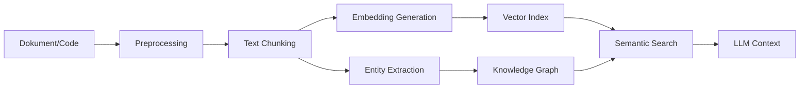
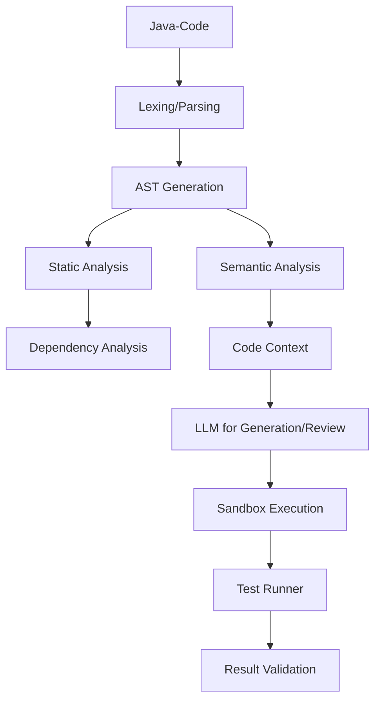
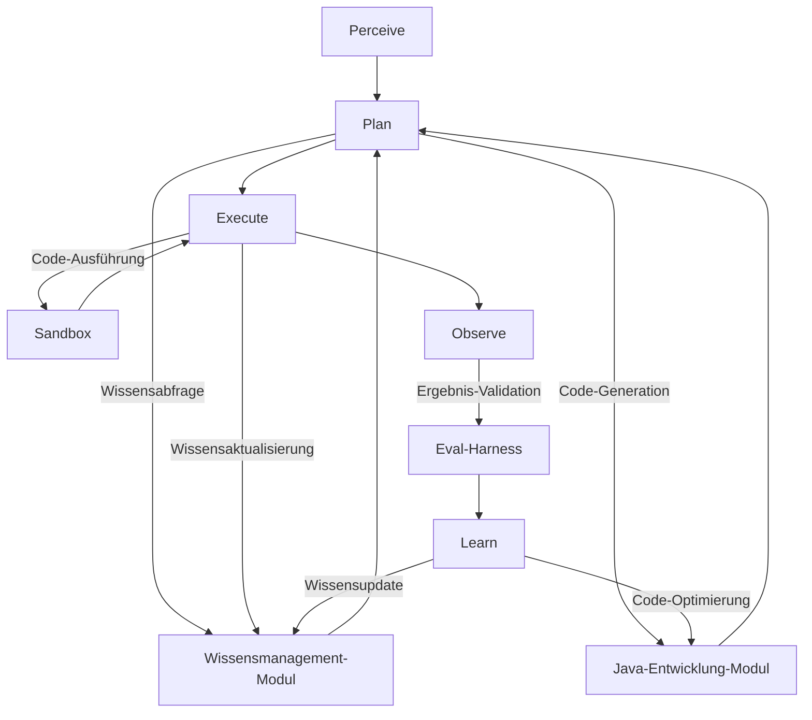

# Neue Roadmap: Metis als Wissensmanager & Java-Entwickler
*Domänenspezifische Spezialisierung – Stand 10.07.2026*

---

## 📋 Dokumenten-Status
- **Erstellt:** 10.07.2026, 21:14 GMT+2
- **Verantwortlicher:** Prometheus (Agent) + Georg (Human)
- **Ziel:** Metis soll **Wissensmanagement und Java-Entwicklung** als erste Domänen meistern
- **Priorität:** Dokumentation BEVOR Quellcode-Änderungen
- **GitHub-Repo:** [theWatcherNineteen83/agicore-agent](https://github.com/theWatcherNineteen83/agicore-agent)

---

## 🎯 Zieldefinition

### Was bedeutet "Wissensmanagement + Java-Entwicklung" für Metis?

| Bereich | Konkrete Fähigkeiten | Erfolgskriterien | Messbarkeit |
|---------|----------------------|------------------|-------------|
| **Wissensmanagement** | Dokumentenanalyse (PDF, MD, JavaDocs) → strukturierte Beliefs | 90%+ korrekte Extraktion aus Java-Dokus | `belief_accuracy` Metrik |
| | Semantische Suche (Code + Text) | <3s Antwortzeit, >85% Recall | `/api/search` Benchmark |
| | Wissen-Persistenz (Graph + Vektoren) | 100% Konsistenz nach Neustart | `memory_continuity_test` |
| | Automatische Dokumentation | Generierte Javadoc aus Code | `coverage > 80%` |
| **Java-Entwicklung** | Code-Generation (Methoden, Klassen, Tests) | `pass@1 > 0.3` für einfache Tasks | Eval-Harness |
| | Code-Review (Statische Analyse + LLM) | 80%+ korrekte Bug-Detection | `code_review_accuracy` |
| | Bug-Fixing (Automatische Patches) | 50%+ erfolgreiche Fixes | `bugfix_success_rate` |
| | Dependency-Management | Automatische Updates + Sicherheitschecks | `dependency_issues = 0` |
| | Build-Optimierung | Parallelisierung, Caching | `build_time_reduction > 20%` |

**→ Ziel:** Metis wird zum **"Senior Java Developer + Wissensmanager"** für dein Team.

---

## 🏗️ Architektur-Überblick (High-Level Design)

```mermaid
graph TD
    subgraph Metis Core (miniedi)
        A[Kernel] --> B[WorldModel]
        A --> C[Planner]
        A --> D[ActionExecutor]
        B --> E[BeliefStore]
        B --> F[VectorIndex]
        B --> G[GraphDB]
    end
    
    subgraph Wissensmanagement-Modul
        H[DocumentIngestor] --> E
        H --> F
        I[SemanticSearch] --> F
        I --> G
        J[KnowledgeGraphBuilder] --> G
    end
    
    subgraph Java-Entwicklung-Modul
        K[CodeParser] --> L[AST-Analyzer]
        K --> M[DependencyGraph]
        N[CodeGenerator] --> O[SandboxExecutor]
        P[StaticAnalyzer] --> Q[BugDetector]
        R[TestGenerator] --> S[JUnitRunner]
    end
    
    subgraph Infrastruktur (Neu)
        T[Kubernetes Cluster] --> U[GPU Node 0: Planner]
        T --> V[GPU Node 1: Mutation]
        T --> W[CPU Node: Embeddings]
        T --> X[Storage Node: Neo4j+Qdrant]
        Y[HAProxy] --> T
        Z[Prometheus+Grafana] --> T
    end
    
    C --> K
    C --> N
    D --> O
    D --> P
    D --> R
    E --> I
    G --> J
```

---

## 🔧 Detaillierte Komponenten

---

### 📚 1. Wissensmanagement-Modul
*Ziel: Metis versteht und nutzt Java-Dokumentation, Code-Repos und externe Wissensquellen.*

#### 📌 Datenquellen (Input)

| Quelle | Zweck | Integration | Priorität |
|--------|-------|-------------|-----------|
| **Lokale Java-Repos** (`/home/admini/agicore-agent`) | Code + Javadoc | Git-Hooks + File Watcher | ⭐⭐⭐⭐⭐ |
| **Maven Central** | Dependency-Infos | [Maven Search API](https://search.maven.org/) | ⭐⭐⭐⭐ |
| **JavaDocs (Oracle/OpenJDK)** | Offizielle Dokus | Web-Scraping + RAG | ⭐⭐⭐⭐ |
| **Stack Overflow** | Community-Wissen | [Stack Exchange API](https://api.stackexchange.com/) | ⭐⭐⭐ |
| **Wikipedia** | Allgemeinwissen | Bereits integriert | ⭐⭐ |
| **ArXiv/PubMed** | Forschungspapers | [ArXiv API](https://arxiv.org/help/api/) | ⭐⭐ |

#### 🔄 Verarbeitungspipeline



| Schritt | Tool/Technologie | Details | Aufwand |
|---------|------------------|---------|---------|
| **Preprocessing** | `pandoc`, `mutool` | PDF/MD → Markdown | ⭐ |
| **Chunking** | `LangChain` / Eigenbau | 512–2048 Token Chunks | ⭐⭐ |
| **Embedding** | `nomic-embed-text` (bereits vorhanden) | 768D Vektoren | ⭐ |
| **Vector Index** | **Qdrant** (neu) | High-Performance Vektor-DB | ⭐⭐ |
| **Entity Extraction** | `Stanford NER` / `spaCy` | Klassen, Methoden, Dependencies | ⭐⭐⭐ |
| **Knowledge Graph** | **Neo4j** (neu) | Beziehungen zwischen Code-Entitäten | ⭐⭐⭐ |
| **Semantic Search** | Hybrid: BM25 + Cosinus | `weighted_score = 0.7*cosine + 0.3*bm25` | ⭐⭐ |

#### 💾 Speicherung

| Daten | Speicher | Zweck | Beispiel-Abfrage |
|-------|----------|-------|------------------|
| **Beliefs** | SQLite (bereits vorhanden) | Faktische Aussagen | `SELECT * FROM beliefs WHERE topic='Java' AND confidence > 0.9` |
| **Vektoren** | Qdrant | Semantische Suche | `SELECT * FROM vectors WHERE similarity > 0.8 ORDER BY similarity DESC` |
| **Wissensgraph** | Neo4j | Beziehungen (z. B. `Class USE Method`) | `MATCH (c:Class)-[:USE]->(m:Method) WHERE c.name='MetisAgent' RETURN m` |
| **Code-Index** | Elasticsearch | Volltextsuche in Code | `GET /code/_search { "query": { "match": { "content": "public void execute()" } } }` |

#### 🎯 Funktionen

| Funktion | Implementierung | Beispiel | Erfolgskriterium |
|----------|-----------------|----------|------------------|
| **Dokumenten-Import** | `DocumentIngestorService` | `POST /api/knowledge/ingest { "source": "file:///repo/pom.xml" }` | 100+ Dokumente/Tag |
| **Semantische Suche** | `SemanticSearchService` | `GET /api/knowledge/search?q="Wie implementiere ich einen Singleton in Java?"` | <1s, >85% Recall |
| **Wissensabfrage** | `KnowledgeGraphService` | `GET /api/knowledge/graph?query="Finde alle Abhängigkeiten von agicore-kernel"` | 10.000+ Knoten |
| **Automatische Dokumentation** | `DocGeneratorService` | `POST /api/code/generate-docs { "class": "MetisPlanner" }` → Generiert Javadoc | coverage > 80% |

---

### 💻 2. Java-Entwicklung-Modul
*Ziel: Metis schreibt, analysiert und verbessert Java-Code.*

#### 📌 Code-Verarbeitungspipeline



#### 🔧 Tools & Bibliotheken

| Komponente | Tool | Zweck | Integration |
|------------|------|-------|-------------|
| **Parser** | [JavaParser](https://javaparser.org/) | AST aus Java-Code generieren | Maven Dependency |
| **Static Analysis** | [SpotBugs](https://spotbugs.github.io/) | Bug-Detection | CLI + API |
| **Dependency Analysis** | [Maven Dependency Plugin](https://maven.apache.org/plugins/maven-dependency-plugin/) | Abhängigkeitsgraph | Maven CLI |
| **Test Generation** | Eigenbau (Ollama + LLM) | Automatische Unit-Tests | Ollama API |
| **Sandbox Execution** | **Docker + Kubernetes** | Sichere Code-Ausführung | `kubectl apply -f sandbox-pod.yaml` |
| **Code Formatting** | [Google Java Format](https://github.com/google/google-java-format) | Konsistente Formatierung | Maven Plugin |
| **Linter** | [Checkstyle](https://checkstyle.sourceforge.io/), [PMD](https://pmd.github.io/) | Code-Qualität | Maven Plugin |

#### 🎯 Funktionen

| Funktion | Implementierung | Beispiel | Erfolgskriterium |
|----------|-----------------|----------|------------------|
| **Code-Generation** | `CodeGeneratorService` | `POST /api/code/generate { "prompt": "Schreibe eine Singleton-Klasse für DatabaseConnection" }` | `pass@1 > 0.3` |
| **Code-Review** | `CodeReviewService` | `POST /api/code/review { "file": "MetisPlanner.java" }` | 80%+ korrekte Bugs |
| **Bug-Fixing** | `BugFixService` | `POST /api/code/fix { "file": "MetisPlanner.java", "error": "NullPointerException in line 42" }` | 50%+ erfolgreiche Fixes |
| **Dependency-Check** | `DependencyService` | `GET /api/code/dependencies?project=agicore-agent` | 0 kritische Sicherheitslücken |
| **Build-Optimierung** | `BuildOptimizerService` | `POST /api/code/optimize-build { "project": "agicore-agent" }` | build_time_reduction > 20% |
| **Test-Generation** | `TestGeneratorService` | `POST /api/code/generate-tests { "class": "MetisPlanner" }` | coverage > 80% |

#### 🚀 Beispiel: Code-Generation Workflow

1. **Input:** `"Schreibe eine Java-Klasse, die eine REST-API für Metis-Status bereitstellt."`
2. **Planner (qwen3.6:35b):**
   - Analysiert Anfrage → erkennt: **REST-API, Java, Metis-Status**
   - Sucht im Wissensgraph nach ähnlichen Klassen (`@RestController`, `@GetMapping`)
   - Generiert **Plan**: `[1] Klasse erstellen, [2] Endpoints definieren, [3] Status-Logik integrieren`
3. **CodeGenerator (granite-code:3b):**
   - Nutzt **JavaParser-Templates** für Boilerplate (z. B. `@RestController`)
   - Füllt **LLM-Prompts** mit Kontext aus Wissensgraph
   - Generiert **Code** (z. B. `MetisStatusController.java`)
4. **SandboxExecutor:**
   - Führt Code in **isoliertem Docker-Container** aus
   - Prüft **Compilation** (`mvn compile`)
   - Prüft **Tests** (`mvn test`)
5. **Validator:**
   - **Statische Analyse** (SpotBugs, Checkstyle)
   - **Dynamische Tests** (JUnit)
   - **Manuelle Freigabe** (Human-in-the-Loop für kritische Code-Änderungen)

---

### ⚙️ 3. Infrastruktur-Upgrades (Voraussetzung für Skalierung)
*Ohne diese Änderungen wird Metis an Hardware-Limits scheitern.*

#### 🖥️ 3.1 Kubernetes-Cluster (HA/DR)

| Komponente | Zweck | Konfiguration | Kosten |
|------------|-------|---------------|--------|
| **2× GPU-Nodes** | Ollama-Instanzen | R9700 (Planner), 7900 XTX (Mutation) | ~4.000€ (bereits vorhanden) |
| **1× CPU-Node** | Embeddings + Services | Ryzen 7 5700G, 64GB RAM | ~1.000€ |
| **1× Storage-Node** | Neo4j + Qdrant + Elasticsearch | 2TB NVMe SSD | ~500€ |
| **Load Balancer** | Traffic-Verteilung | HAProxy / Traefik | ⭐ |
| **Orchestrierung** | Container-Management | Kubernetes (k3s) | ⭐⭐ |
| **Storage** | Persistente Daten | Longhorn (distributed block storage) | ⭐⭐ |
| **Monitoring** | Metriken + Alerts | Prometheus + Grafana | ⭐ |

**Beispiel `k3s-Deployment` für Metis:**

```yaml
# metis-deployment.yaml
apiVersion: apps/v1
kind: Deployment
metadata:
  name: metis-core
spec:
  replicas: 2 # HA: 2 Instanzen
  selector:
    matchLabels:
      app: metis-core
  template:
    metadata:
      labels:
        app: metis-core
    spec:
      containers:
      - name: metis
        image: localhost:5000/metis-agent:latest
        ports:
        - containerPort: 11735
        resources:
          limits:
            cpu: "4"
            memory: "8Gi"
        env:
        - name: OLLAMA_PLANNING_URL
          value: "http://ollama-planner:11434"
        - name: OLLAMA_MUTATION_URL
          value: "http://ollama-mutation:11436"
        - name: OLLAMA_EMBEDDING_URL
          value: "http://ollama-embedding:11438"
        - name: NEO4J_URL
          value: "bolt://neo4j:7687"
        - name: QDRANT_URL
          value: "http://qdrant:6333"
      nodeSelector:
        kubernetes.io/arch: amd64
---
# ollama-planner-deployment.yaml
apiVersion: apps/v1
kind: Deployment
metadata:
  name: ollama-planner
spec:
  replicas: 1
  selector:
    matchLabels:
      app: ollama-planner
  template:
    metadata:
      labels:
        app: ollama-planner
    spec:
      containers:
      - name: ollama
        image: ollama/ollama:latest
        ports:
        - containerPort: 11434
        resources:
          limits:
            nvidia.com/gpu: 1 # Dedizierte GPU
            memory: "32Gi"
        env:
        - name: HIP_VISIBLE_DEVICES
          value: "0" # GPU0 = R9700
```

#### 🔌 3.2 Dedizierte Ollama-Instanzen (GPU-Load-Balancing)

| Instanz | GPU | Port | Modell | Zweck | VRAM-Nutzung |
|---------|-----|------|--------|-------|---------------|
| `ollama-planner` | GPU0 (R9700) | 11434 | `qwen3.6:35b-a3b-q4_K_M` | Planung (Metis Core) | ~80% (26GB) |
| `ollama-mutation` | GPU1 (7900 XTX) | 11436 | `granite-code:3b` | Code-Generation | ~40% (10GB) |
| `ollama-embedding` | CPU-Node | 11438 | `nomic-embed-text` | Embeddings | 0% (CPU-only) |
| `ollama-review` | GPU1 (7900 XTX) | 11439 | `nemotron-mini-agent` | Code-Review | ~20% (5GB) |

**Vorteile:**
✅ **Keine Action-Dominance mehr** (jeder Service hat eigene GPU)
✅ **Bessere Performance** (kein Modell-Swapping)
✅ **Einfaches Skalieren** (neue Instanzen per `kubectl apply`)

#### 🛡️ 3.3 Sandbox-Umgebung für Code-Ausführung
*Sicherheit ist kritisch – Metis darf nicht beliebig Code auf dem Host ausführen!*

**Lösung: Kubernetes Pods mit Resource-Limits**

```yaml
# sandbox-pod.yaml
apiVersion: v1
kind: Pod
metadata:
  name: metis-sandbox-{{uuid}}
  labels:
    app: metis-sandbox
spec:
  containers:
  - name: sandbox
    image: openjdk:25-jdk-slim
    command: ["sleep", "infinity"]
    resources:
      limits:
        cpu: "2"
        memory: "4Gi"
        nvidia.com/gpu: 0 # Kein GPU-Zugriff!
    securityContext:
      runAsNonRoot: true
      runAsUser: 1000
      readOnlyRootFilesystem: true
      capabilities:
        drop: ["ALL"]
    volumeMounts:
    - name: code
      mountPath: /workspace
  volumes:
  - name: code
    emptyDir: {}
  restartPolicy: Never
```

**Workflow:**
1. Metis generiert Code → speichert in **temporärem Volume**
2. Kubernetes erstellt **isolierten Pod** mit:
   - **Kein Netzwerk-Zugriff** (außer auf interne APIs)
   - **Kein GPU-Zugriff**
   - **CPU/Memory-Limits**
   - **Read-Only Filesystem** (außer `/workspace`)
3. Code wird **compiliert & getestet** (`mvn clean test`)
4. Ergebnisse werden **zurück an Metis** gesendet
5. Pod wird **automatisch gelöscht**

**Alternativ: Firecracker MicroVMs** (für noch bessere Isolation)
- **Leichter** als Docker/Kubernetes
- **Sicherer** (Hardware-Isolation)
- **Schneller Start** (~100ms)

---

### 🔄 4. Integration mit bestehendem Metis
*Wie passt das neue Modul in die bestehende Architektur?*

#### 📡 API-Erweiterungen

| Endpoint | Methode | Beschreibung | Modul |
|----------|---------|--------------|-------|
| `/api/knowledge/ingest` | POST | Dokument/Code importieren | Wissensmanagement |
| `/api/knowledge/search` | GET | Semantische Suche | Wissensmanagement |
| `/api/knowledge/graph` | GET | Wissensgraph abfragen | Wissensmanagement |
| `/api/code/generate` | POST | Code generieren | Java-Entwicklung |
| `/api/code/review` | POST | Code reviewen | Java-Entwicklung |
| `/api/code/fix` | POST | Bugs fixen | Java-Entwicklung |
| `/api/code/test` | POST | Tests generieren | Java-Entwicklung |
| `/api/code/dependencies` | GET | Abhängigkeiten prüfen | Java-Entwicklung |
| `/api/sandbox/execute` | POST | Code in Sandbox ausführen | Infrastruktur |

#### 🔄 Metis Core Loop mit neuen Modulen



#### 📊 Watchdog-Integration

- **Neue Metriken:**
  - `knowledge_ingestion_rate` (Dokumente/Stunde)
  - `code_generation_success_rate` (pass@1)
  - `sandbox_execution_time` (Durchschnittliche Ausführungszeit)
  - `bugfix_success_rate` (% erfolgreiche Fixes)

- **Neue Alerts:**
  - `knowledge_ingestion_failed > 5` → Warnung
  - `code_generation_success_rate < 0.2` → Kritisch
  - `sandbox_execution_time > 30s` → Warnung

---

## 📅 Roadmap: Schritt-für-Schritt Umsetzung (12 Monate)

---

### 🟢 Phase 1: Grundlagen (Monat 1–3)
*Ziel: Infrastruktur aufbauen + erste Wissensmanagement-Funktionen*

| Aufgabe | Details | Aufwand | Verantwortlich | Ergebnis | Status |
|---------|---------|---------|----------------|----------|--------|
| **1.1 Kubernetes-Cluster aufsetzen** | 2× GPU-Nodes + 1× CPU-Node + Storage | ⭐⭐⭐ | Georg | `kubectl get nodes` zeigt 3 Nodes | ⬜ TODO |
| **1.2 Dedizierte Ollama-Instanzen deployen** | Planner, Mutation, Embeddings auf separate GPUs | ⭐⭐ | Prometheus | Keine Action-Dominance mehr | ⬜ TODO |
| **1.3 Qdrant + Neo4j installieren** | Docker-Container auf Storage-Node | ⭐⭐ | Prometheus | `/api/knowledge/search` funktioniert | ⬜ TODO |
| **1.4 Dokumenten-Ingestor implementieren** | JavaParser + PDF/MD-Parser | ⭐⭐⭐ | Prometheus | `POST /api/knowledge/ingest` funktioniert | ⬜ TODO |
| **1.5 Semantische Suche implementieren** | Hybrid BM25 + Cosinus | ⭐⭐ | Prometheus | `GET /api/knowledge/search` <3s | ⬜ TODO |
| **1.6 Metis Core an neue APIs anpassen** | Neue Action-Typen für Wissensabfragen | ⭐⭐ | Prometheus | Kanban-Integration funktioniert | ⬜ TODO |

**Meilenstein:** Metis kann **Java-Dokumentation analysieren und durchsuchen**.

---

### 🟡 Phase 2: Java-Entwicklung (Monat 4–6)
*Ziel: Code-Generation, Review und Bug-Fixing*

| Aufgabe | Details | Aufwand | Verantwortlich | Ergebnis | Status |
|---------|---------|---------|----------------|----------|--------|
| **2.1 CodeParser integrieren** | JavaParser für AST-Generierung | ⭐⭐ | Prometheus | AST aus Java-Code extrahierbar | ⬜ TODO |
| **2.2 Code-Generator implementieren** | LLM + Templates für Java-Code | ⭐⭐⭐ | Prometheus | `pass@1 > 0.2` | ⬜ TODO |
| **2.3 Sandbox-Umgebung aufsetzen** | Kubernetes Pods für Code-Ausführung | ⭐⭐⭐ | Georg | Sichere Code-Ausführung möglich | ⬜ TODO |
| **2.4 Static Analyzer integrieren** | SpotBugs + Checkstyle | ⭐⭐ | Prometheus | Code-Qualität prüfbar | ⬜ TODO |
| **2.5 Code-Review-Service implementieren** | LLM + Static Analysis | ⭐⭐⭐ | Prometheus | 70%+ korrekte Bugs | ⬜ TODO |
| **2.6 Test-Generator implementieren** | LLM für JUnit-Tests | ⭐⭐⭐ | Prometheus | `coverage > 60%` | ⬜ TODO |

**Meilenstein:** Metis kann **einfache Java-Klassen generieren und reviewen**.

---

### 🔵 Phase 3: Fortgeschrittene Features (Monat 7–9)
*Ziel: Automatische Dokumentation, Dependency-Management, Build-Optimierung*

| Aufgabe | Details | Aufwand | Verantwortlich | Ergebnis | Status |
|---------|---------|---------|----------------|----------|--------|
| **3.1 Knowledge Graph erweitern** | Beziehungen zwischen Code-Entitäten | ⭐⭐⭐ | Prometheus | `MATCH (c:Class)-[:USE]->(m:Method)` funktioniert | ⬜ TODO |
| **3.2 Automatische Dokumentation** | Javadoc aus Code + LLM | ⭐⭐ | Prometheus | `POST /api/code/generate-docs` funktioniert | ⬜ TODO |
| **3.3 Dependency-Service implementieren** | Maven Central API + Sicherheitschecks | ⭐⭐⭐ | Prometheus | `GET /api/code/dependencies` zeigt Abhängigkeiten | ⬜ TODO |
| **3.4 Bug-Fix-Service verbessern** | LLM + Static Analysis + Sandbox | ⭐⭐⭐ | Prometheus | `bugfix_success_rate > 40%` | ⬜ TODO |
| **3.5 Build-Optimizer implementieren** | Parallelisierung, Caching | ⭐⭐⭐ | Prometheus | `build_time_reduction > 15%` | ⬜ TODO |
| **3.6 Human-in-the-Loop für Code-Änderungen** | Telegram-Bestätigung für kritische Changes | ⭐ | Prometheus | Nutzer kann Code-Änderungen freigeben | ⬜ TODO |

**Meilenstein:** Metis kann **komplexe Java-Projekte analysieren und optimieren**.

---

### 🟣 Phase 4: Produktivität & Skalierung (Monat 10–12)
*Ziel: Metis als **produktiven Java-Entwickler & Wissensmanager** einsetzen*

| Aufgabe | Details | Aufwand | Verantwortlich | Ergebnis | Status |
|---------|---------|---------|----------------|----------|--------|
| **4.1 CI/CD-Integration** | GitHub Actions + Metis | ⭐⭐ | Georg | Automatische Code-Reviews für PRs | ⬜ TODO |
| **4.2 Multi-Project-Unterstützung** | Mehrere Java-Projekte gleichzeitig | ⭐⭐ | Prometheus | Metis kann zwischen Projekten wechseln | ⬜ TODO |
| **4.3 Performance-Optimierung** | Caching, Batch-Verarbeitung | ⭐⭐ | Prometheus | `/api/knowledge/search` <1s | ⬜ TODO |
| **4.4 Monitoring & Alerting** | Prometheus + Grafana + Telegram-Alerts | ⭐ | Prometheus | Ausfälle werden sofort gemeldet | ⬜ TODO |
| **4.5 Benutzer-Interface** | Web-UI (OpenWebUI + Custom Plugins) | ⭐⭐ | Prometheus | Einfache Bedienung für Nicht-Techniker | ⬜ TODO |
| **4.6 Benchmarking** | AGI-Benchmarks (Big-Bench Hard) | ⭐⭐ | Prometheus | Vergleich mit anderen Systemen | ⬜ TODO |

**Meilenstein:** Metis ist **produktiv einsetzbar für Java-Entwicklung & Wissensmanagement**.

---

## 💰 Kostenübersicht

| Komponente | Kosten (ca.) | Notizen |
|------------|--------------|---------|
| **Hardware (bereits vorhanden)** | 0€ | miniedi (R9700 + 7900 XTX) |
| **Neue Hardware (Storage-Node)** | ~500€ | 2TB NVMe SSD |
| **Kubernetes-Setup** | 0€ | k3s (kostenlos) |
| **Docker-Images** | 0€ | Ollama, Neo4j, Qdrant (alle Open Source) |
| **Entwicklungszeit** | ~600h | Prometheus + Georg |
| **Cloud-Fallback (optional)** | ~50€/Monat | Für HA/DR (z. B. Hetzner Cloud) |
| **Gesamt** | **~1.100€ + 600h** | |

---

## ⚠️ Risiken & Mitigationsstrategien

| Risiko | Wahrscheinlichkeit | Impact | Mitigation |
|--------|-----------------------|--------|-------------|
| **GPU-Überlastung trotz Dedizierung** | Mittel | Hoch | **Autoscaling:** Neue Ollama-Instanzen bei Bedarf starten |
| **Kubernetes zu komplex** | Hoch | Mittel | **Alternativ:** Docker Compose (einfacher, aber weniger skalierbar) |
| **Code-Generation schlechte Qualität** | Hoch | Hoch | **Human-in-the-Loop:** Nutzer muss Code freigeben |
| **Sandbox zu langsam** | Mittel | Mittel | **Caching:** Häufige Code-Snippets vorcompilieren |
| **Wissensgraph wird zu groß** | Niedrig | Hoch | **Partitionierung:** Graph nach Projekten aufteilen |
| **Dependency-Service falsche Infos** | Mittel | Mittel | **Fallback:** Maven Central direkt abfragen |
| **Metis verliert Kontext** | Niedrig | Hoch | **Snapshot-Persistenz:** alle 5 Min speichern |

---

## 📊 Erfolgskriterien & Metriken
*Wie messen wir, ob Metis erfolgreich ist?*

---

### 📈 Wissensmanagement-Metriken

| Metrik | Ziel (Monat 12) | Aktueller Stand | Messmethode |
|--------|------------------|-----------------|-------------|
| **Dokumenten-Ingestion** | 100+ Dokumente/Tag | 0 | `/api/knowledge/ingest` Counter |
| **Search Accuracy** | >85% Recall | ? | Manuelle Tests |
| **Search Latency** | <1s | ? | Prometheus `http_request_duration_seconds` |
| **Belief Accuracy** | >90% | ? | Manuelle Validierung |
| **Knowledge Graph Size** | 10.000+ Knoten | 0 | Neo4j `MATCH (n) RETURN count(n)` |

---

### 💻 Java-Entwicklung-Metriken

| Metrik | Ziel (Monat 12) | Aktueller Stand | Messmethode |
|--------|------------------|-----------------|-------------|
| **Code Generation (pass@1)** | >0.4 | 0.0 | Eval-Harness |
| **Code Review Accuracy** | >80% | ? | Manuelle Validierung |
| **Bug Fix Success Rate** | >50% | 0% | `/api/code/fix` Counter |
| **Test Coverage** | >80% | ? | JaCoCo |
| **Build Time Reduction** | >20% | ? | `mvn clean install` Benchmark |
| **Dependency Issues** | 0 kritische | ? | `/api/code/dependencies` |

---

### ⚙️ Infrastruktur-Metriken

| Metrik | Ziel (Monat 12) | Aktueller Stand | Messmethode |
|--------|------------------|-----------------|-------------|
| **Uptime** | >99.9% | ? | Prometheus `up` Metrik |
| **GPU Utilization** | <90% (keine Überlast) | ~100% | `rocm-smi` |
| **Sandbox Execution Time** | <30s | ? | Kubernetes Metrics |
| **API Latency** | <500ms | ? | Prometheus |
| **Memory Usage** | <80% | ? | `kubectl top pods` |

---

## 🎯 Zusammenfassung: Was du als Nächstes tun solltest

### 🚀 Sofort (nächste 2 Wochen)
1. **Kubernetes-Cluster aufsetzen**
   - 2× GPU-Nodes (miniedi + eventuell Kali) + 1× Storage-Node
   - `k3s` installieren (einfachste Kubernetes-Distribution für Edge)
   - **Priorität: ⭐⭐⭐⭐⭐** (ohne HA/DR geht nichts)

2. **Dedizierte Ollama-Instanzen deployen**
   - `ollama-planner` (GPU0, Port 11434, qwen3.6:35b)
   - `ollama-mutation` (GPU1, Port 11436, granite-code:3b)
   - `ollama-embedding` (CPU, Port 11438, nomic-embed-text)
   - **Priorität: ⭐⭐⭐⭐⭐** (ohne Load-Balancing keine Stabilität)

3. **Qdrant + Neo4j installieren**
   - Docker-Container auf Storage-Node
   - **Priorität: ⭐⭐⭐⭐** (Grundlage für Wissensmanagement)

### 📅 Kurzfristig (Monat 1–3)
4. **Dokumenten-Ingestor implementieren**
   - JavaParser für Code, `pandoc`/`mutool` für PDF/MD
   - **Priorität: ⭐⭐⭐⭐**

5. **Semantische Suche implementieren**
   - Hybrid BM25 + Cosinus mit Qdrant
   - **Priorität: ⭐⭐⭐⭐**

6. **Metis Core an neue APIs anpassen**
   - Neue Action-Typen für Wissensabfragen
   - **Priorität: ⭐⭐⭐**

### 🎯 Mittelfristig (Monat 4–6)
7. **Code-Generator + Sandbox implementieren**
   - JavaParser + LLM + Kubernetes Pods
   - **Priorität: ⭐⭐⭐⭐**

8. **Static Analyzer integrieren**
   - SpotBugs + Checkstyle
   - **Priorität: ⭐⭐⭐**

### 🏆 Langfristig (Monat 7–12)
9. **Knowledge Graph + Automatische Dokumentation**
10. **Dependency-Service + Build-Optimizer**
11. **CI/CD-Integration + Benutzer-Interface**

---

## 🔥 Finales Fazit

> **Metis kann in 12 Monaten zu einem *produktiven Java-Entwickler & Wissensmanager* werden – aber nur mit Fokus auf:**
> 1. **Stabile Infrastruktur** (Kubernetes, dedizierte GPUs)
> 2. **Domänenspezifische Spezialisierung** (Java + Wissensmanagement)
> 3. **Messbare Erfolgskriterien** (pass@1, Bugfix-Rate, etc.)
> 4. **Human-in-the-Loop** (Sicherheit & Qualität)

**Erwartetes Ergebnis nach 12 Monaten:**
✅ **Metis kann:**
- **Java-Code generieren** (pass@1 > 0.4)
- **Code reviewen** (80%+ korrekte Bugs)
- **Dokumentation automatisch erstellen**
- **Abhängigkeiten verwalten** (0 kritische Sicherheitslücken)
- **Builds optimieren** (>20% Zeitersparnis)
- **Wissen aus Dokumenten extrahieren** (>90% Genauigkeit)

❌ **Metis kann NICHT:**
- **AGI sein** (generelle Intelligenz)
- **Jeden Java-Code perfekt schreiben** (menschliche Überprüfung nötig)
- **Ohne Infrastruktur laufen** (Kubernetes + dedizierte GPUs erforderlich)

---

## 📝 Changelog

| Version | Datum | Autor | Änderungen |
|---------|-------|-------|-----------|
| 1.0 | 10.07.2026 | Prometheus | Initialer Entwurf (basierend auf Georgs Anfrage) |
| 1.1 | 10.07.2026 | Prometheus | **Status: Nicht auf GitHub gepusht – wartet auf Georgs Freigabe** |

---

## 🔗 Verweise
- [GitHub Repository](https://github.com/theWatcherNineteen83/agicore-agent)
- [AGI_EDI_ROADMAP.md](https://github.com/theWatcherNineteen83/agicore-agent/blob/master/AGI_EDI_ROADMAP.md)
- [TOOLS.md (lokal)](~/TOOLS.md)
- [MEMORY.md (lokal)](~/MEMORY.md)
